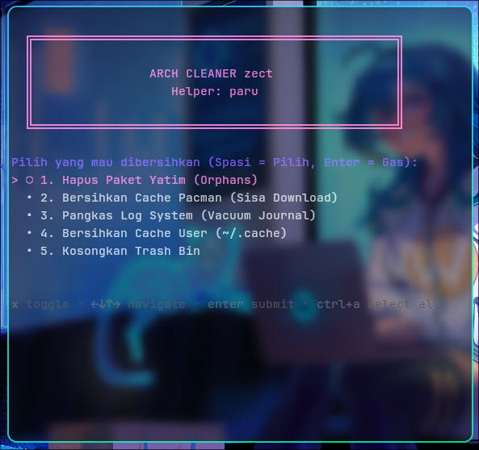

# Arch Maintenance Hub (AMH)


**Enterprise-grade system maintenance dashboard and telemetry tool for Arch Linux, CachyOS, and Manjaro.**
*Designed for stability, efficiency, and professional system administration.*



---

## 👨‍💻 Author & Maintainer

**Muhammad Adam Zaky Jiddyansah**
*(System Administrator & Linux Automation Specialist)*

> "Automation is not just about saving time; it's about reliability and precision in system management."
> — **Muhammad Adam Zaky Jiddyansah**

---

## 🚀 Overview

**Arch Maintenance Hub** is a sophisticated TUI (Text User Interface) tool written in Bash. Unlike standard cleaner scripts, AMH provides a **real-time system health dashboard** and a modular approach to system hygiene.

It is specifically engineered for **Arch-based distributions** to handle package orphans, cache management, sandbox environments (Flatpak/Snap), and residual configuration files safely without breaking the system.

## ✨ Key Features

| Module | Functionality |
| :--- | :--- |
| **📊 Telemetry Dashboard** | Real-time visual monitoring of **CPU Load**, **RAM Usage**, **Disk I/O**, and **Systemd Services** status using responsive ASCII bar charts. |
| **⚙️ Core Maintenance** | Automates `pacman`/`paru`/`yay` orphan removal, cache cleaning, and systemd journal vacuuming (2-weeks retention). |
| **📦 Sandbox Manager** | Specialized module to manage **Flatpak** and **Snap** environments. Includes inventory listing and pruning of unused runtimes/dependencies. |
| **🗑️ Config Cleaner** | "Ghost Config Hunter" — Interactively scans `~/.config/` to identify and remove residual configuration folders from uninstalled applications. |
| **🛡️ Safety First** | Built-in TTY enforcement prevents input flickering and ensures safe execution of deletion commands. |

## 🛠 Dependencies

The tool automatically checks and installs missing dependencies via your native package manager:

* **`gum`** (Charm Bracelet) - For the modern TUI elements.
* **`bc`** - For floating-point arithmetic in telemetry calculations.
* **`pacman`** (or AUR helpers like `paru` / `yay`).

## 📦 Installation

To install **Arch Maintenance Hub** on your system, execute the following commands in your terminal:

```bash
# 1. Clone the repository
git clone [https://github.com/adamzakys/arch-cleaner.git](https://github.com/adamzakys/arch-cleaner.git)

# 2. Navigate to the directory
cd arch-cleaner

# 3. Make the script executable
chmod +x install.sh

# 4. Install
./install.sh

#5. Run 
arch-cleaner
